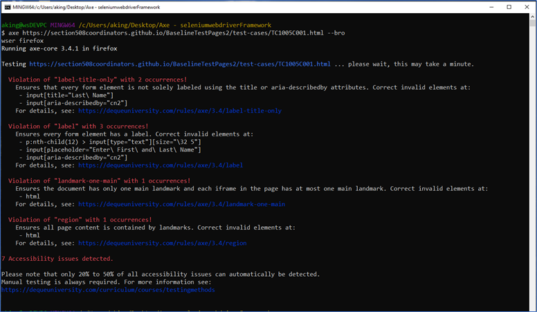

# axe-core basic examples: CLI

Go to the [GitHub Playbook-Automation published page](https://section508coordinators.github.io/Dev-Automation/)

## Tool: @axe-core/cli

The  @axe-core/cli tool provides the tester with a command line interface for axe-core accessibility library to run accessibly tests.

This folder presents fully functioning examples of how to use the @axe-core/cli tool for quick and easy accessibility testing.

## Automated tools and rulesets

Because automated tools provide the tester with the efficiency of pass/fail conclusions,  it is critical to thoroughly assess that logic – also known as its ***rules***. A tool’s collective rules or ruleset should be assessed to determine its accuracy as well as the degree to which its logic aligns with your organization’s ***target accessibility standard***. In the case of DHS, the target accessibility standard to which the automated tools on this site are compared are as follows:

#### DHS target accessibility standard

- [The Section 508 ICT Testing Baseline for Web (October 2020 | version 3.0)](https://section508coordinators.github.io/ICTTestingBaseline/) (ICT Baseline)
- [Trusted Tester: Section 508  Conformance Test Process for Web (June 2019 | version 5.0)](https://section508coordinators.github.io/TrustedTester/) (TTv5)

#### Ruleset assessments and recommended rules

Not all automated tool rulesets on the market perfectly align with the pass/fail success criteria as expressed by the DHS standard. However upon analysis, DHS OAST has identified specific rules, for specific vendor accessibility ruleset libraries, that provide value in identifying accessibility to the DHS Standard.   

Those analyses of vendor accessibility rulesets and the OAST ruleset recommendations reside in the following folder on this site: https://github.com/Section508Coordinators/Dev-Automation/tree/master/rulesets.

## Technology requirements

- Nodejs 6+
- Git (Bash window)
- Chrome browser version 59+
- Chrome WebDriver for your version of Chrome

## Setup

1. Install Nodejs 6+
2. Install axe-core CLI globally: `npm install @axe-core/cli -g`
3. Running the examples, as is, will require the following regarding web browsers and webdrivers for those browsers:
   1. **Chrome**
      1. Requires Chrome browser version 59+
      2. Install Chromedriver that corresponds to your Chrome version
   2. **Other browsers**
      1. Install any other browser and browser driver you want to experiment with - outside of the included  examples.

## Usage/Syntax

Review the many examples below of implementing the axe-core CLI.

#### Test a single page

After installing, you can now run the axe command in your CLI, followed by the URL of the page you wish to test:

- `axe <webpage url>`

#### Test multiple pages

You can run multiple pages at once, simply add more URLs to the command. Keep in mind that axe-cli is not a crawler, so if you find yourself testing dozens of pages at once, you may want to consider switching over to something like axe-webdriverjs. If you do not specify the protocol, http will be used by default:

- `axe <page1>, <page2>` (Note that there is a space after the comma in the syntax)

Run against code on local machine on the file system (not hosted by server)

- axe  `<filesystem path>/<filename>` or `axe /c/_test/TC1005C001.html`       

#### Specify rules

- `axe <webpage> --rules <rule1>,<rule2>,<rule3>` (Note that there is no space after the comma in the syntax)

#### Specify tags

  Run using all rules with a specified tag (see tag listing below)

- `axe <webpage> --tags wcag2a` (note the tags are case-sensitive and cannot be combined with the --rules tag)

#### Specify browser

- `axe <webpage> --browser <browser>` (Note that any browser other than chrome must have a webdriver installed, and the folder location of that driver executable must be included in the PC environment’s PATH statement).

#### Specify send results to JSON file

Results can be saved as JSON data, using the --save and --dir flags. By passing a filename to --save you indicate how the file should be called. If no filename is passed, a default will be used:

- `axe <webpage> --save <JSON file name>`
- `axe <webpage> --dir <folder location, i.e. “./results/”>`

#### Specify send results to STDOUT

To output the test results to STDOUT, provide the --stdout flag. This flag has the side-effect of silencing all other logs/output (other than errors, which are written to STDERR).

- To print the entire result object to your terminal:
  - `axe --stdout <url>`
- To pipe the results to a file:
  - `axe --stdout www.deque.com > your_file.json`
- To pipe the results to a JSON-parsing program for further processing, do:
  - `axe --stdout www.deque.com | jq ".[0].violations"`

#### Defining the scope of a test

If you want to only test a specific area of a page, or wish to exclude some part of a page you can do so using the --include and --exclude flags and pass it a CSS selector:

- `axe www.deque.com --include "#main" --exclude "#aside`
- You may pass multiple selectors with a comma-delimited string. For example:
  - `axe www.deque.com --include "#div1,#div2,#div3"`

#### Custom axe-core versions

Axe-cli will look for locally available versions of axe-core. If the directory from where you start axe-cli has an axe.js file, or has a node_modules directory with axe-core installed in it. Axe-cli will use this version of axe-core instead of the default version installed globally.

To specify the exact file axe-core file axe-cli should use, you can use the --axe-source flag (-a for short), with a relative or absolute path to the file.

- axe www.deque.com --axe-source ./axe.nl.js

#### Custom Chrome Flags

When using the Headless Chrome browser, you may provide any number of flags to configure how the browser functions.  Options are passed by name, without their leading -- prefix. For example, to provide the --no-sandbox --disable-setuid-sandbox --disable-dev-shm-usage flags to the Chrome binary, you'd do:

- `axe --chrome-options="no-sandbox,disable-setuid-sandbox,disable-dev-shm-usage" www.deque.com`
   

## Examples

#### Example 1

<u>Description</u>: One page test, Firefox browser, default axe- ruleset

Command: `axe https://section508coordinators.github.io/BaselineTestPages2/test-cases/TC1005C001.html --browser firefox`

***Console window output:***

#### Example 2

<u>Description</u>: Multi-page test, chrome browser, specific test rules only, save results to JSON file.

<u>Command</u>: `axe https://section508coordinators.github.io/BaselineTestPages2/test-cases/TC1005C001.html, https://section508coordinators.github.io/BaselineTestPages2/test-cases/TC1005C009.html --rules label,aria-input-field-name --browser chrome --save TestCase-site.json`

***Console window output:***

## Example 3

<u>Description</u>: One-page test using OAST-recommended rules only

<u>Command</u>: `axe www.ibm.com --rules scrollable-region-focusable,role-img-alt,image-alt,color-contrast,aria-hidden-focus,aria-input-field-name,aria-toggle-field-name,label,form-field-multiple-labels,document-title,td-headers-attr,empty-heading,listitem,link-name,input-image-alt,input-button-name,button-name,html-has-lang,html-lang-valid,valid-lang,frame-title,duplicate-id`

***Console window output:***

 

## Tips

1. Always be aware of the currently published version of the axe-core library. If you want to run with the most current version – which will likely have you up to date on the latest rules and bug fixes, be sure to periodically update your copy of the library and note the axe-core version message when running CLI: “*`Running axe-core <library version> in <selected browser*>`”
2. Be wary of using the --tags option. Results obtained by OAST through testing are questionable. OAST has recommended testing using individual rules in favor of using tags.

## Appendix

### Tags Listing

| **Tag Name**  | **Accessibility Standard/Purpose**          |
| ------------- | ------------------------------------------- |
| wcag2a        | WCAG 2.0 & WCAG 2.1 Level A                 |
| wcag2aa       | WCAG 2.0 & WCAG 2.1 Level AA                |
| wcag21a       | WCAG 2.1 Level A                            |
| wcag21aa      | WCAG 2.1 Level AA                           |
| section508    | Section 508                                 |
| best-practice | Best practices endorsed by Deque            |
| experimental  | Cutting-edge techniques                     |
| cat           | Category mappings used by Deque (see below) |

 

## More information

More information on the axe-core CLI can be found here: https://github.com/dequelabs/axe-core-npm/tree/develop/packages/cli.

01/30/2021 | 06:25p

