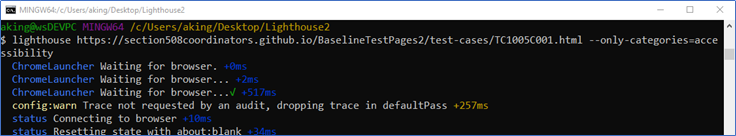
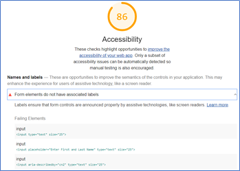
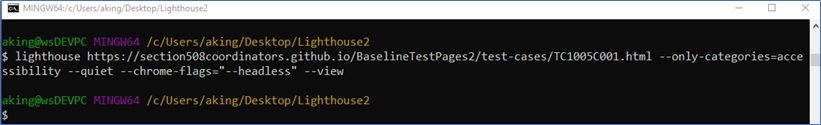
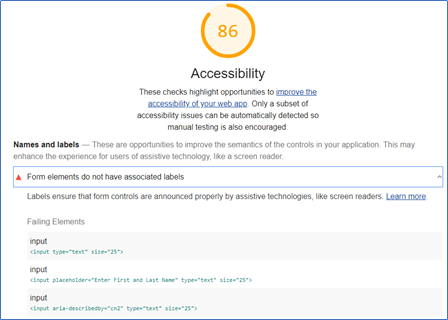
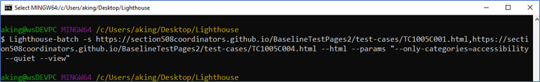
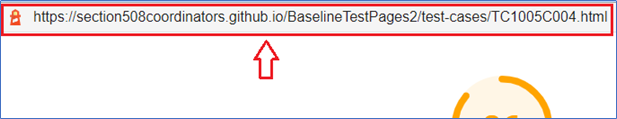
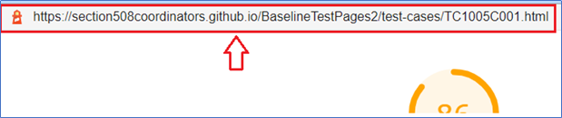
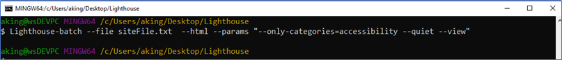

# lighthouse basic examples: CLI

<hr>

Go to the [GitHub Playbook-Automation published page](https://section508coordinators.github.io/Dev-Automation/)

<hr>
Google lighthouse provides 2 tools that execute accessibility (and other) testing from the command line as described below.

## Tool: Lighthouse CLI

The Lighthouse CLI provides flexibility in how Lighthouse runs and provides the tester with this flexibility within a command line interface (command window).

## Tool: Lighthouse batch

Supports executing [Lighthouse](https://developers.google.com/web/tools/lighthouse) analysis *over a number of sites* in sequence and generating a summary report including all of their scores. Scores are calculated from the average score between Performance, PWA, Accessibility and Best Practice and SEO sections.

Also writes out the full `json` report for each site and optionally an `html` report.

<hr>

## Automated tools and rulesets

Because automated tools provide the tester with the efficiency of pass/fail conclusions,  it is critical to thoroughly assess that logic – also known as its ***rules***. A tool’s collective rules or ruleset should be assessed to determine its accuracy as well as the degree to which its logic aligns with your organization’s ***target accessibility standard***. In the case of DHS, the target accessibility standard to which the automated tools on this site are compared are as follows:

#### DHS target accessibility standard

- [The Section 508 ICT Testing Baseline for Web (October 2020 | version 3.0)](https://section508coordinators.github.io/ICTTestingBaseline/) (ICT Baseline)
- [Trusted Tester: Section 508  Conformance Test Process for Web (June 2019 | version 5.0)](https://section508coordinators.github.io/TrustedTester/) (TTv5)

#### Ruleset assessments and recommended rules

Not all automated tool rulesets on the market perfectly align with the pass/fail success criteria as expressed by the DHS standard. However upon analysis, DHS OAST has identified specific rules, for specific vendor accessibility ruleset libraries, that provide value in identifying accessibility to the DHS Standard.   

Those analyses of vendor accessibility rulesets and the OAST ruleset recommendations reside in the following folder on this site: https://github.com/Section508Coordinators/Dev-Automation/tree/master/rulesets.

<hr>

## Technology requirements


This example uses the following technology stack:

- Chrome desktop browser installed
- Nodejs 12+
- Git (Bash window)
- Google lighthouse
- Lighthouse Batch Reporter

## Setup

#### Lighthouse CLI

1. Install Chrome Desktop (if not already installed)
2. Install Nodejs 12+
3. Install lighthouse: `npm install -g lighthouse`
   1. or use yarn: `yarn global add lighthouse`

#### Lighthouse Batch

1. Install Chrome Desktop (if not already installed)
2. Install Nodejs 12+
3. Install lighthouse-batch globally: `npm install lighthouse-batch -g`

## Usage/Syntax

Review the examples below of implementing the lighthouse CLI.

<hr>

### Lighthouse CLI


#### Basic syntax

`lighthouse <url>`

See flag descriptions below.

#### Logging:

```
  --verbose  Displays verbose logging  [boolean] [default: false]
  --quiet    Displays no progress, debug logs, or errors  [boolean] [default: false]
```

#####  Configuration:

```
--save-assets                  Save the trace contents & devtools logs to disk  [boolean] [default: false]
--list-all-audits              Prints a list of all available audits and exits  [boolean] [default: false]
  --list-trace-categories        Prints a list of all required trace categories and exits  [boolean] [default: false]
--print-config                 Print the normalized config for the given config and options, then exit.  [boolean] [default: false]
  --additional-trace-categories  Additional categories to capture with the trace (comma-delimited).  [string]
--config-path                  The path to the config JSON.
                                 An example config file: lighthouse-core/config/lr-desktop-config.js  [string]
--preset                       Use a built-in configuration.
                                 WARNING: If the --config-path flag is provided, this preset will be ignored.  [string] [choices: "perf", "experimental", "desktop"]
--chrome-flags                 Custom flags to pass to Chrome (space-delimited). For a full list of flags, see https://bit.ly/chrome-flags
                                 Additionally, use the CHROME_PATH environment variable to use a specific Chrome binary. Requires Chromium version 66.0 or later. If omitted, any detected Chrome Canary or Chrome stable will be used.  [string] [default: ""]
--port                         The port to use for the debugging protocol. Use 0 for a random port  [number] [default: 0]
--hostname                     The hostname to use for the debugging protocol.  [string] [default: "localhost"]
--form-factor                  Determines how performance metrics are scored and if mobile-only audits are skipped. For desktop, --preset=desktop instead.  [string] [choices: "mobile", "desktop"]
--screenEmulation              Sets screen emulation parameters. See also --preset. Use --screenEmulation.disabled to disable. Otherwise set these 4 parameters individually: --screenEmulation.mobile --screenEmulation.width=360 --screenEmulation.height=640 --screenEmulation.deviceScaleFactor=2
--emulatedUserAgent            Sets useragent emulation  [string]
--max-wait-for-load            The timeout (in milliseconds) to wait before the page is considered done loading and the run should continue. WARNING: Very high values can lead to large traces and instability  [number]
--enable-error-reporting       Enables error reporting, overriding any saved preference. --no-enable-error-reporting will do the opposite. More: https://git.io/vFFTO  [boolean]
  --gather-mode, -G              Collect artifacts from a connected browser and save to disk. (Artifacts folder path may optionally be provided). If audit-mode is not also enabled, the run will quit early.
--audit-mode, -A               Process saved artifacts from disk. (Artifacts folder path may be provided, otherwise defaults to ./latest-run/)
--only-audits                  Only run the specified audits  [array]
--only-categories              Only run the specified categories. Available categories: accessibility, best-practices, performance, pwa, seo  [array]
--skip-audits                  Run everything except these audits  [array]
--budget-path                  The path to the budget.json file for LightWallet.  [string]
```

 

#####  Output:

```
--output       Reporter for the results, supports multiple values. choices: "json", "html", "csv"  [array] [default: ["html"]]
--output-path  The file path to output the results. Use 'stdout' to write to stdout.
                   If using JSON output, default is stdout.
                   If using HTML or CSV output, default is a file in the working directory with a name based on the test URL and date.
                   If using multiple outputs, --output-path is appended with the standard extension for each output type. "reports/my-run" -> "reports/my-run.report.html", "reports/my-run.report.json", etc.
                   Example: --output-path=./lighthouse-results.html  [string]
--view         Open HTML report in your browser  [boolean] [default: false]
```

 

##### Options:

```
--version                            Show version number  [boolean]
--help                               Show help  [boolean]
--cli-flags-path                     The path to a JSON file that contains the desired CLI flags to apply. Flags specified at the command line will still override the file-based ones.
--locale                             The locale/language the report should be formatted in
--blocked-url-patterns               Block any network requests to the specified URL patterns  [array]
--disable-storage-reset              Disable clearing the browser cache and other storage APIs before a run  [boolean]
--throttling-method                  Controls throttling method  [string] [choices: "devtools", "provided", "simulate"]
--throttling
--throttling.rttMs                   Controls simulated network RTT (TCP layer)
--throttling.throughputKbps          Controls simulated network download throughput
--throttling.requestLatencyMs        Controls emulated network RTT (HTTP layer)
--throttling.downloadThroughputKbps  Controls emulated network download throughput
--throttling.uploadThroughputKbps    Controls emulated network upload throughput
--throttling.cpuSlowdownMultiplier   Controls simulated + emulated CPU throttling
--extra-headers                      Set extra HTTP Headers to pass with request
  --precomputed-lantern-data-path      Path to the file where lantern simulation data should be read from, overwriting the lantern observed estimates for RTT and server latency.  [string]
  --lantern-data-output-path           Path to the file where lantern simulation data should be written to, can be used in a future run with the `precomputed-lantern-data-path` flag.  [string]
--plugins                            Run the specified plugins  [array]
--channel  [string] [default: "cli"]
--chrome-ignore-default-flags  [boolean] [default: false]
```

##### Examples:

```
lighthouse <url> --view                                                                          Opens the HTML report in a browser after the run completes
lighthouse <url> --config-path=./myconfig.js                                                     Runs Lighthouse with your own configuration: custom audits, report generation, etc.
lighthouse <url> --output=json --output-path=./report.json --save-assets                         Save trace, screenshots, and named JSON report.
lighthouse <url> --screenEmulation.disabled --throttling-method=provided --no-emulatedUserAgent  Disable device emulation and all throttling
lighthouse <url> --chrome-flags="--window-size=412,660"                                          Launch Chrome with a specific window size
lighthouse <url> --quiet --chrome-flags="--headless"                                             Launch Headless Chrome, turn off logging
lighthouse <url> --extra-headers "{\"Cookie\":\"monster=blue\", \"x-men\":\"wolverine\"}"        Stringify'd JSON HTTP Header key/value pairs to send in requests
lighthouse <url> --extra-headers=./path/to/file.json                                             Path to JSON file of HTTP Header key/value pairs to send in requests
lighthouse <url> --only-categories=performance,pwa                                               Only run the specified categories. Available categories: accessibility, best-practices, performance, pwa, seo
```

<hr>


### Lighthouse batch

#### All syntax

```
lighthouse-batch [options]

Options:
  -V, --version                 output the version number
  -s, --sites [sites]           a comma delimited list of site urls to analyze with Lighthouse
  -f, --file [path]             an input file with a site url per-line to analyze with Lighthouse
  -p, --params <params>         extra parameters to pass to lighthouse cli for each execution e.g. -p "--perf --quiet"
  -h, --html                    generate an html report alongside the json report
  --csv                         generate a csv report alongside the json report
  -o, --out [out]               the output folder to place reports, defaults to './report/lighthouse'
  --score <threshold>           average score for each site to meet (1-100)
  --accessibility <threshold>   accessibility score for each site to meet (1-100)
  --best-practices <threshold>  best practices score for each site to meet (1-100)
  --seo <threshold>             seo score for each site to meet (1-100)
  --pwa <threshold>             pwa score for each site to meet (1-100)
  --fail-fast                   fail as soon as a budget threshold is not met
  -g, --use-global              use a global lighthouse install instead of the dependency version
  -v, --verbose                 enable verbose logging
  --no-report                   remove individual json reports for each site
  --print                       print the final summary to stdout
  -h, --help                    output usage information
```

<hr>

## Examples

#### Example 1

Description: Runs only the audit (test) for accessibility only against one URL, launches a visual instance of Chrome briefly while testing the page then closes chrome and writes a report to your local machine file system. All the while the command window scrolls progress log of all processing going on as it happens:

Command: `lighthouse https://section508coordinators.github.io/BaselineTestPages2/test-cases/TC1005C001.html --only-categories=accessibility` 

***Console window output:***



***Report that is written to file system:***





<hr>

#### Example 2

Description: Runs only the audits (tests) for accessibility against one URL, runs a headless instance of Chrome, sends no processing feedback to command window, and automatically opens the report written to the file system in your browser when done:

Command: `lighthouse https://section508coordinators.github.io/BaselineTestPages2/test-cases/TC1005C001.html --only-categories=accessibility --quiet --chrome-flags="--headless" --view` 

***Console window output:***




***Report that opens automatically in browser:***




<hr>

#### Example 3

Description: Runs only the audits (tests) for accessibility against multiple URLs, runs a headless instance of Chrome, sends no processing feedback to command window, and automatically opens all reports written to the file system in your browser as they finish:

Command: `Lighthouse-batch -s https://section508coordinators.github.io/BaselineTestPages2/test-cases/TC1005C001.html,https://section508coordinators.github.io/BaselineTestPages2/test-cases/TC1005C004.html --html --params "--only-categories=accessibility --quiet --view"`

***Console window output:***



***Subsequent HTML results files with URLs in top left to indicate which site URL it is the results for:***






 <hr>

#### Example 4

Description: Runs a batch of multiple URLs that are pulled from a separate ***siteFile.txt\*** file of URLs, only the audits (tests) for accessibility, runs a headless instance of Chrome, sends no processing feedback to command window, and automatically opens all reports written to the file system in your browser as they finish:

Command: `Lighthouse-batch --file siteFile.txt --html --params "--only-categories=accessibility --quiet --view"`

***Console window output:***



***Contents of siteFile.txt (5 URLs):***

- https://section508coordinators.github.io/BaselineTestPages2/test-cases/TC1112A001.html
- https://section508coordinators.github.io/BaselineTestPages2/test-cases/TC1112A002.html
- https://section508coordinators.github.io/BaselineTestPages2/test-cases/TC0813C001.html
- https://section508coordinators.github.io/BaselineTestPages2/test-cases/TC1005C004.html
- https://section508coordinators.github.io/BaselineTestPages2/test-cases/TC1005C005.html


<hr>

# Notes

Chrome is run with the following flags to support the widest set of execution environments, including docker containers `--chrome-flags="--no-sandbox --headless --disable-gpu"`. You can replace these with your own by passing `--chrome-flags` as extra parameters. e.g.

```
--params "--chrome-flags=\"--no-sandbox --disable-gpu\""
```


<hr>

# More Information

For more information on Lighthouse, see https://developers.google.com/web/tools/lighthouse/.

https://github.com/GoogleChrome/lighthouse


For more information on Lighthouse batch, see: https://www.npmjs.com/package/lighthouse-batch


<hr>

02/02/2021 | 03:35p

