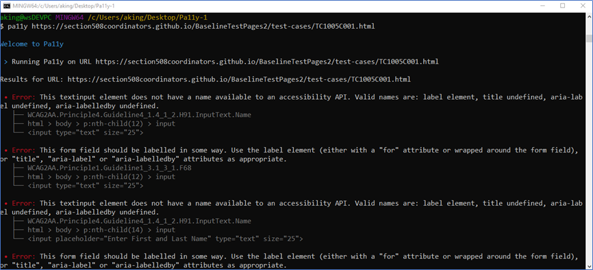
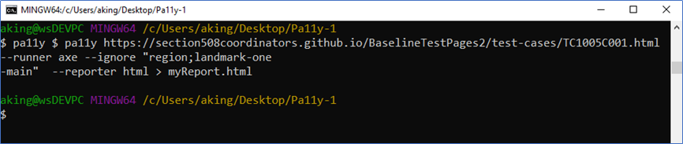
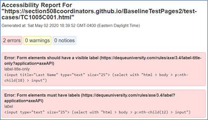
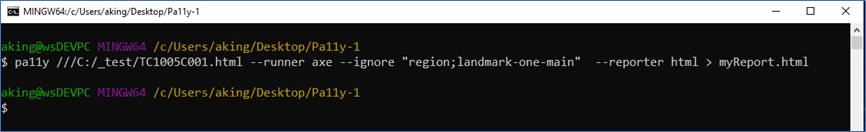
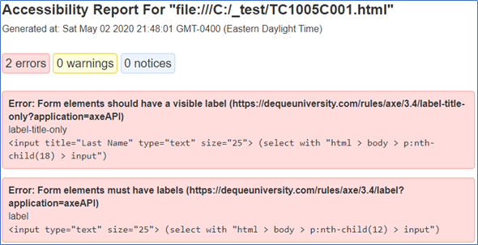

# pa11y basic examples: CLI

---

Go to the [GitHub Playbook-Automation published page](https://section508coordinators.github.io/Dev-Automation/)

---

## Tool: pa11y CLI

This tool provides the tester with a command line interface that accesses the pa11y test engine to automate accessibility testing using a variety of test automate vendor rulesets.

This folder presents fully functioning examples of how to use this tool for quick and easy accessibility testing.

---

## Automated tools and rulesets


#### Ruleset assessments and recommended rules

This tool allows the user to pick and choose the individual, underlying rules for testing. Not all automated tool rulesets on the market perfectly align with the pass/fail success criteria as expressed by the DHS standard. However upon analysis, DHS OAST has identified specific rules, for specific vendor accessibility ruleset libraries, that provide value in identifying accessibility to the DHS Standard.

Those analyses of vendor accessibility rulesets and the OAST ruleset recommendations reside in [rulesets folder](/rulesets) on this site.

---

## Technology requirements


This example uses the following technology stack:

- Nodejs 8+
- Git (Bash window)
- [Pa11y 4](https://github.com/pa11y/pa11y/tree/4.x)+

---

## Setup

1. Install Nodejs 8+
2. Install pa11y globally: `npm install -g pa11y`

## Usage/Syntax

This installs the `pa11y` command-line tool:

```
Usage: pa11y [options] <url>

  Options:

    -V, --version                  output the version number
    -n, --environment              output details about the environment Pa11y will run in
    -s, --standard <name>          the accessibility standard to use: Section508, WCAG2A, WCAG2AA (default), WCAG2AAA – only used by htmlcs runner
    -r, --reporter <reporter>      the reporter to use: cli (default), csv, json
    -e, --runner <runner>          the test runners to use: htmlcs (default), axe
    -l, --level <level>            the level of issue to fail on (exit with code 2): error, warning, notice
    -T, --threshold <number>       permit this number of errors, warnings, or notices, otherwise fail with exit code 2
    -i, --ignore <ignore>          types and codes of issues to ignore, a repeatable value or separated by semi-colons
    --include-notices              Include notices in the report
    --include-warnings             Include warnings in the report
    -R, --root-element <selector>  a CSS selector used to limit which part of a page is tested
    -E, --hide-elements <hide>     a CSS selector to hide elements from testing, selectors can be comma separated
    -c, --config <path>            a JSON or JavaScript config file
    -t, --timeout <ms>             the timeout in milliseconds
    -w, --wait <ms>                the time to wait before running tests in milliseconds
    -d, --debug                    output debug messages
    -S, --screen-capture <path>    a path to save a screen capture of the page to
    -A, --add-rule <rule>          WCAG 2.0 rules to include, a repeatable value or separated by semi-colons – only used by htmlcs runner
    -h, --help                     output usage information
```


Review the many examples below of implementing the pa11y CLI tool.

---

#### Run an accessibility test against a URL

```
pa11y http://example.comRun an accessibility test against a file (absolute paths only, not relative):
pa11y ./path/to/your/file.html
```

#### Run a test with CSV reporting and save to a file:

```
pa11y --reporter csv http://example.com > report.csv
```

#### Run pa11y with the Section508 ruleset

```
pa11y --standard Section508 http://example.com
```

#### Run pa11y using [aXe](https://www.axe-core.org/) as a [test runner](https://github.com/pa11y/pa11y#runners)

```
pa11y --runner axe http://example.com
```

#### Run pa11y using [aXe](https://www.axe-core.org/) *and* [HTML CodeSniffer](http://squizlabs.github.com/HTML_CodeSniffer/) as [test runners](https://github.com/pa11y/pa11y#runners):

```
pa11y --runner axe --runner htmlcs http://example.com
```

#### Exit Codes

The command-line tool uses the following exit codes:

- `0`: Pa11y ran successfully, and     there are no errors
- `1`: Pa11y failed run due to a     technical fault
- `2`: Pa11y ran successfully but     there are errors in the page

By default, only accessibility issues with a type of `error` will exit with a code of `2`. This is configurable with the `--level` flag which can be set to one of the following:

- `error`: exit with a code of `2` on errors only, exit with     a code of `0` on     warnings and notices
- `warning`: exit with a code of `2` on errors and warnings,     exit with a code of `0` on     notices
- `notice`: exit with a code of `2` on errors, warnings, and     notices
- `none`: always exit with a code     of `0`

### Command-Line Configuration

The command-line tool can be configured with a JSON file as well as arguments. By default it will look for a `pa11y.json` file in the current directory, but you can change this with the `--config` flag:

```
pa11y --config ./path/to/config.json http://example.com
```

If any configuration is set both in a configuration file and also as a command-line option, the value set in the latter will take priority.

For more information on configuring Pa11y, see the [configuration documentation](https://github.com/pa11y/pa11y#configuration).

### Customizing rules used: "ignore" option

The ignore flag can be used in several different ways to cite rules that should not be used during testing as follows. 

##### Separated by semi-colons:

```
pa11y --ignore "issue-code-1;issue-code-2" http://example.com
```

##### or by using the flag multiple times:

```
pa11y --ignore issue-code-1 --ignore issue-code-2 http://example.com
```

Pa11y can also ignore notices, warnings, and errors up to a threshold number. This might be useful if you're using CI and don't want to break your build. The following example will return exit code 0 on a page with 9 errors, and return exit code 2 on a page with 10 or more errors.

```
pa11y --threshold 10 http://example.com
```

#### Reporters

The command-line tool can report test results in a few different ways using the `--reporter` flag. The built-in reporters are:

- `cli`: output test results in a     human-readable format
- `csv`: output test results as     comma-separated values
- `json`: output test results as a JSON     array

The Pa11y team maintains additional reporters which can be installed separately via `npm`:

- [`html`](https://github.com/pa11y/pa11y-reporter-html): output test results in a self-contained HTML     format (`npm     install pa11y-reporter-html`)
- [`tsv`](https://github.com/pa11y/pa11y-reporter-tsv): output test results as tab-separated values (`npm install pa11y-reporter-tsv`)

You can also write and publish your own reporters. Pa11y looks for reporters in your `node_modules` folder (with a naming pattern), and the current working directory. The first reporter found will be loaded. So with this command:

```
pa11y --reporter rainbows http://example.com
```

The following locations will be checked:

```
<cwd>/node_modules/pa11y-reporter-rainbows
<cwd>/rainbows
```

A Pa11y reporter *must* export a property named `supports`. This is a [semver range](https://github.com/npm/node-semver#ranges) (as a string) which indicates which versions of Pa11y the reporter supports:

```
exports.supports = '^5.0.0';
```

A reporter should export the following methods, which should all return strings. If your reporter needs to perform asynchronous operations, then it may return a promise which resolves to a string:

```
begin(); // Called when pa11y starts
error(message); // Called when a technical error is reported
debug(message); // Called when a debug message is reported
info(message); // Called when an information message is reported
results(results); // Called with the results of a test run
```

---

## Examples

#### Example 1

Description: Single page default test runner (HTML Code Sniffer) and all default rules:

Command: `pa11y https://section508coordinators.github.io/BaselineTestPages2/test-cases/TC1005C001.html` 
 ***Console window output:*** 



---

#### Example 2

<u>Description</u>: Single page test, specific preferred rules only, results saved as an HTML file with the name **myReport.html**.

<u>Command</u>: `pa11y $ pa11y https://section508coordinators.github.io/BaselineTestPages2/test-cases/TC1005C001.html --runner axe --ignore "region;landmark-one-main" --reporter html > myReport.html`

***Console window output:*** 



 ***Resulting HTML Report Files***



---

#### Example 3

<u>Description</u>: Single page test against a file on the local file system (not hosted on web site), specific preferred rules only, results saved as an HTML file with the name **myReport.html**.

<u>Command</u>: `pa11y ///C:/_test/TC1005C001.html --runner axe --ignore "region;landmark-one-main" --reporter html > myReport.html`

***Console window output:\***
 

***Subsequent HTML results file:*** 



---

## More Information

For more information on syntax for using this example, see the pa11y syntax information here: https://github.com/pa11y/pa11y

---

02/19/2021 | 10:37a

